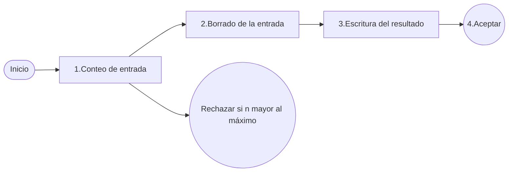

# Máquina de Turing de Fibonacci (versión para aprender desde cero)

## Idea general (sin teoría complicada)

La máquina recibe una cantidad de `1` seguidos.
- Si ve `1111`, eso significa `n = 4`.
- Su meta es dejar en la cinta `F(n)` en unario (también con `1`).

---

## Fases y qué hace cada una

### 1) Conteo de entrada
- La cabeza avanza hacia la derecha leyendo `1` por `1`.
- Cada `1` leído equivale a contar una unidad de `n`.
- Cuando encuentra `_` (blanco), significa que terminó la entrada.
- Si intentan entrar más de lo permitido por la máquina (en tu JSON, mayor a 10), va a rechazo.

### 2) Borrado de la entrada
- Después de contar, la máquina regresa y borra los `1` originales.
- Esto deja la cinta limpia para escribir solo la respuesta final.

### 3) Escritura del resultado
- Según el `n` contado, la máquina sabe cuánto vale `F(n)`.
- Entonces escribe exactamente esa cantidad de `1`.
- Ejemplo: si `n=4`, escribe `111` porque `F(4)=3`.

### 4) Aceptar
- Cuando ya terminó de escribir, entra al estado de aceptación.
- En ese punto, la cinta contiene el resultado.

### Rechazar
- Si la entrada supera el límite de diseño (en tu caso `n>10`), entra a rechazo.

---

## Mini ejemplo completo

Entrada: `1111` (esto es `n=4`)

1. Cuenta 4 símbolos `1`.
2. Borra esos 4 símbolos.
3. Escribe 3 símbolos `1` (`F(4)=3`).
4. Termina en aceptar.

Salida final en cinta: `111`

---

## Cómo se conecta con tus estados reales

- `q0..q10`  -> fase de **conteo**
- `qErase0..qErase10` -> fase de **borrado**
- `qWritei_0..qWritei_Fi` -> fase de **escritura**
- `qAccept` / `qReject` -> fin de ejecución
