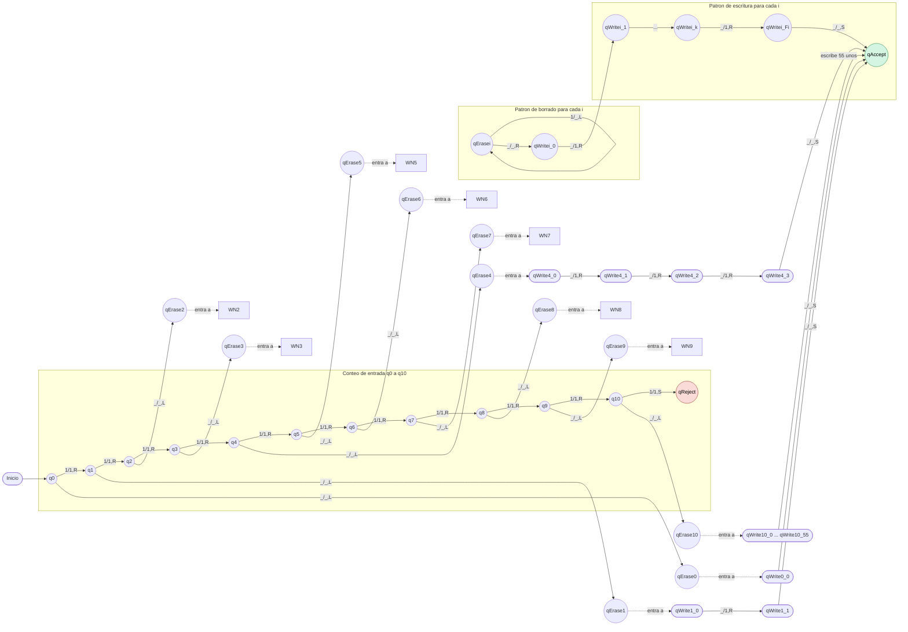

# Diagrama de transiciones (MT Fibonacci)

## Convención de etiquetas

Cada etiqueta tiene formato: `lee/escribe,movimiento`.

- `1/1,R`: lee `1`, escribe `1`, mueve a la derecha.
- `1/_,L`: lee `1`, escribe blanco `_`, mueve a la izquierda.
- `_/_,S`: lee blanco, escribe blanco, no se mueve.
