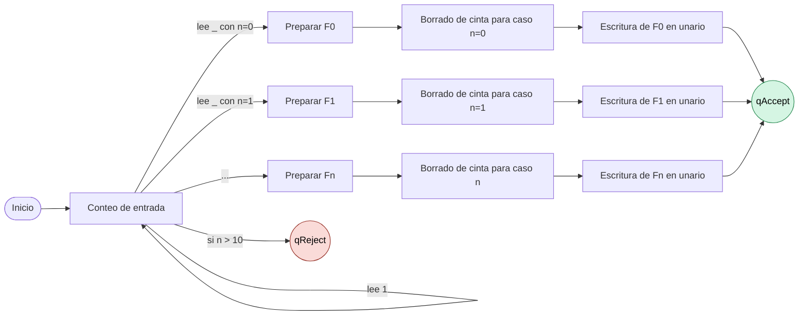

# Diagrama de transiciones simplificado (MT Fibonacci)

## Cómo leerlo

- `Conteo de entrada` resume los estados `q0..q10`.
- `Borrado de cinta` resume los estados `qErase0..qErase10`.
- `Escritura de F(n)` resume las cadenas `qWritei_0..qWritei_F(i)`.
- `qReject` ocurre cuando la entrada excede el máximo configurado (`n > 10`).

## Recomendación para entrega

- Usa este diagrama simplificado en el cuerpo principal del informe.
- Deja el diagrama detallado en [diagrama_transiciones.md](diagrama_transiciones.md) como anexo técnico.
