# Diagrama completo de la MT real

```mermaid
graph LR

  %% Nodos (todos los estados del JSON)
  qA_GoHash["qA_GoHash"]
  qA_ReturnBar["qA_ReturnBar"]
  qA_WriteHash["qA_WriteHash"]
  qAccept["qAccept"]
  qB_GoHash["qB_GoHash"]
  qB_ReturnBar["qB_ReturnBar"]
  qB_WriteHash["qB_WriteHash"]
  qBackToBarAfterEraseA["qBackToBarAfterEraseA"]
  qBackToBarFromHash["qBackToBarFromHash"]
  qClearC["qClearC"]
  qCopyAScan["qCopyAScan"]
  qCopyBScan["qCopyBScan"]
  qEraseA["qEraseA"]
  qFinalizeData["qFinalizeData"]
  qFinalizeEraseLeft["qFinalizeEraseLeft"]
  qFinalizeGoBar["qFinalizeGoBar"]
  qGoBarForIter["qGoBarForIter"]
  qInitEmptyWriteB["qInitEmptyWriteB"]
  qInitEmptyWriteHash["qInitEmptyWriteHash"]
  qInitScanN["qInitScanN"]
  qInitWriteB["qInitWriteB"]
  qInitWriteHash["qInitWriteHash"]
  qLeftOverNX["qLeftOverNX"]
  qLoopSeekN["qLoopSeekN"]
  qReject["qReject"]
  qRelabelPass["qRelabelPass"]
  qRestoreA["qRestoreA"]
  qRestoreB["qRestoreB"]
  qReturnToNStart["qReturnToNStart"]
  qStart["qStart"]

  %% Transiciones (auto-generadas desde JSON)
  qStart -->|1/n,R| qInitScanN
  qStart -->|_/BAR,R| qInitEmptyWriteB
  qInitScanN -->|1/n,R| qInitScanN
  qInitScanN -->|_/BAR,R| qInitWriteB
  qInitWriteB -->|_/b,R| qInitWriteHash
  qInitWriteHash -->|_/#,L| qReturnToNStart
  qInitEmptyWriteB -->|_/b,R| qInitEmptyWriteHash
  qInitEmptyWriteHash -->|_/#,L| qReturnToNStart
  qReturnToNStart -->|a/a,L| qReturnToNStart
  qReturnToNStart -->|A/A,L| qReturnToNStart
  qReturnToNStart -->|b/b,L| qReturnToNStart
  qReturnToNStart -->|B/B,L| qReturnToNStart
  qReturnToNStart -->|c/c,L| qReturnToNStart
  qReturnToNStart -->|_/_,L| qReturnToNStart
  qReturnToNStart -->|#/#,L| qReturnToNStart
  qReturnToNStart -->|BAR/BAR,L| qLeftOverNX
  qLeftOverNX -->|n/n,L| qLeftOverNX
  qLeftOverNX -->|x/x,L| qLeftOverNX
  qLeftOverNX -->|_/_,R| qLoopSeekN
  qLoopSeekN -->|n/x,R| qGoBarForIter
  qLoopSeekN -->|x/x,R| qLoopSeekN
  qLoopSeekN -->|BAR/BAR,L| qFinalizeEraseLeft
  qGoBarForIter -->|n/n,R| qGoBarForIter
  qGoBarForIter -->|x/x,R| qGoBarForIter
  qGoBarForIter -->|BAR/BAR,R| qClearC
  qClearC -->|c/_,R| qClearC
  qClearC -->|a/a,R| qClearC
  qClearC -->|A/A,R| qClearC
  qClearC -->|b/b,R| qClearC
  qClearC -->|B/B,R| qClearC
  qClearC -->|_/_,R| qClearC
  qClearC -->|#/#,L| qBackToBarFromHash
  qBackToBarFromHash -->|a/a,L| qBackToBarFromHash
  qBackToBarFromHash -->|A/A,L| qBackToBarFromHash
  qBackToBarFromHash -->|b/b,L| qBackToBarFromHash
  qBackToBarFromHash -->|B/B,L| qBackToBarFromHash
  qBackToBarFromHash -->|c/c,L| qBackToBarFromHash
  qBackToBarFromHash -->|_/_,L| qBackToBarFromHash
  qBackToBarFromHash -->|BAR/BAR,R| qCopyAScan
  qCopyAScan -->|A/A,R| qCopyAScan
  qCopyAScan -->|b/b,R| qCopyAScan
  qCopyAScan -->|B/B,R| qCopyAScan
  qCopyAScan -->|c/c,R| qCopyAScan
  qCopyAScan -->|_/_,R| qCopyAScan
  qCopyAScan -->|a/A,R| qA_GoHash
  qCopyAScan -->|#/#,L| qRestoreA
  qA_GoHash -->|A/A,R| qA_GoHash
  qA_GoHash -->|a/a,R| qA_GoHash
  qA_GoHash -->|b/b,R| qA_GoHash
  qA_GoHash -->|B/B,R| qA_GoHash
  qA_GoHash -->|c/c,R| qA_GoHash
  qA_GoHash -->|_/_,R| qA_GoHash
  qA_GoHash -->|#/c,R| qA_WriteHash
  qA_WriteHash -->|_/#,L| qA_ReturnBar
  qA_ReturnBar -->|a/a,L| qA_ReturnBar
  qA_ReturnBar -->|A/A,L| qA_ReturnBar
  qA_ReturnBar -->|b/b,L| qA_ReturnBar
  qA_ReturnBar -->|B/B,L| qA_ReturnBar
  qA_ReturnBar -->|c/c,L| qA_ReturnBar
  qA_ReturnBar -->|_/_,L| qA_ReturnBar
  qA_ReturnBar -->|#/#,L| qA_ReturnBar
  qA_ReturnBar -->|BAR/BAR,R| qCopyAScan
  qRestoreA -->|A/a,L| qRestoreA
  qRestoreA -->|a/a,L| qRestoreA
  qRestoreA -->|b/b,L| qRestoreA
  qRestoreA -->|B/B,L| qRestoreA
  qRestoreA -->|c/c,L| qRestoreA
  qRestoreA -->|_/_,L| qRestoreA
  qRestoreA -->|BAR/BAR,R| qCopyBScan
  qCopyBScan -->|B/B,R| qCopyBScan
  qCopyBScan -->|a/a,R| qCopyBScan
  qCopyBScan -->|A/A,R| qCopyBScan
  qCopyBScan -->|c/c,R| qCopyBScan
  qCopyBScan -->|_/_,R| qCopyBScan
  qCopyBScan -->|b/B,R| qB_GoHash
  qCopyBScan -->|#/#,L| qRestoreB
  qB_GoHash -->|A/A,R| qB_GoHash
  qB_GoHash -->|a/a,R| qB_GoHash
  qB_GoHash -->|b/b,R| qB_GoHash
  qB_GoHash -->|B/B,R| qB_GoHash
  qB_GoHash -->|c/c,R| qB_GoHash
  qB_GoHash -->|_/_,R| qB_GoHash
  qB_GoHash -->|#/c,R| qB_WriteHash
  qB_WriteHash -->|_/#,L| qB_ReturnBar
  qB_ReturnBar -->|a/a,L| qB_ReturnBar
  qB_ReturnBar -->|A/A,L| qB_ReturnBar
  qB_ReturnBar -->|b/b,L| qB_ReturnBar
  qB_ReturnBar -->|B/B,L| qB_ReturnBar
  qB_ReturnBar -->|c/c,L| qB_ReturnBar
  qB_ReturnBar -->|_/_,L| qB_ReturnBar
  qB_ReturnBar -->|#/#,L| qB_ReturnBar
  qB_ReturnBar -->|BAR/BAR,R| qCopyBScan
  qRestoreB -->|B/b,L| qRestoreB
  qRestoreB -->|a/a,L| qRestoreB
  qRestoreB -->|A/A,L| qRestoreB
  qRestoreB -->|b/b,L| qRestoreB
  qRestoreB -->|c/c,L| qRestoreB
  qRestoreB -->|_/_,L| qRestoreB
  qRestoreB -->|BAR/BAR,R| qEraseA
  qEraseA -->|a/_,R| qEraseA
  qEraseA -->|b/b,R| qEraseA
  qEraseA -->|c/c,R| qEraseA
  qEraseA -->|A/A,R| qEraseA
  qEraseA -->|B/B,R| qEraseA
  qEraseA -->|_/_,R| qEraseA
  qEraseA -->|#/#,L| qBackToBarAfterEraseA
  qBackToBarAfterEraseA -->|a/a,L| qBackToBarAfterEraseA
  qBackToBarAfterEraseA -->|A/A,L| qBackToBarAfterEraseA
  qBackToBarAfterEraseA -->|b/b,L| qBackToBarAfterEraseA
  qBackToBarAfterEraseA -->|B/B,L| qBackToBarAfterEraseA
  qBackToBarAfterEraseA -->|c/c,L| qBackToBarAfterEraseA
  qBackToBarAfterEraseA -->|_/_,L| qBackToBarAfterEraseA
  qBackToBarAfterEraseA -->|BAR/BAR,R| qRelabelPass
  qRelabelPass -->|b/a,R| qRelabelPass
  qRelabelPass -->|c/b,R| qRelabelPass
  qRelabelPass -->|a/a,R| qRelabelPass
  qRelabelPass -->|A/A,R| qRelabelPass
  qRelabelPass -->|B/B,R| qRelabelPass
  qRelabelPass -->|_/_,R| qRelabelPass
  qRelabelPass -->|#/#,L| qReturnToNStart
  qFinalizeEraseLeft -->|x/_,L| qFinalizeEraseLeft
  qFinalizeEraseLeft -->|n/_,L| qFinalizeEraseLeft
  qFinalizeEraseLeft -->|_/_,R| qFinalizeGoBar
  qFinalizeGoBar -->|_/_,R| qFinalizeGoBar
  qFinalizeGoBar -->|BAR/_,R| qFinalizeData
  qFinalizeData -->|a/1,R| qFinalizeData
  qFinalizeData -->|b/_,R| qFinalizeData
  qFinalizeData -->|c/_,R| qFinalizeData
  qFinalizeData -->|A/_,R| qFinalizeData
  qFinalizeData -->|B/_,R| qFinalizeData
  qFinalizeData -->|_/_,R| qFinalizeData
  qFinalizeData -->|#/_,S| qAccept

  %% Resaltado de estados especiales
  classDef acceptState fill:#d1fae5,stroke:#059669,stroke-width:2px,color:#065f46
  classDef rejectState fill:#fee2e2,stroke:#dc2626,stroke-width:2px,color:#7f1d1d
  class qAccept acceptState
  class qReject rejectState
```

## Nota

Este es el diagrama completo de la máquina de Turing real, auto-generado directamente a partir de `fib_tm_real.json`. Incluye todos los estados declarados y todas las transiciones definidas en el JSON.
