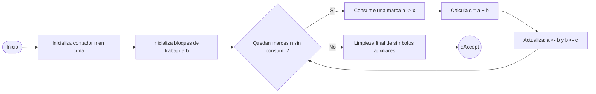

# Diagrama simplificado de la MT real (por fases)

Este diagrama describe la máquina de [fib_tm_real.json](fib_tm_real.json).

## Relación con estados del JSON

- Inicio / preparación: `qStart`, `qInit*`, `qReturnToNStart`.
- Bucle principal: `qLoopSeekN`, `qGoBarForIter`.
- Cálculo de suma y actualización: estados `qCopy*`, `qA_*`, `qB_*`, `qRelabelPass`, `qRestore*`.
- Finalización: `qFinalize*`, `qAccept`.

## Nota

Los diagramas anteriores de `q0..q10`, `qErase*` y `qWrite*` se conservan como versión tabulada previa.
